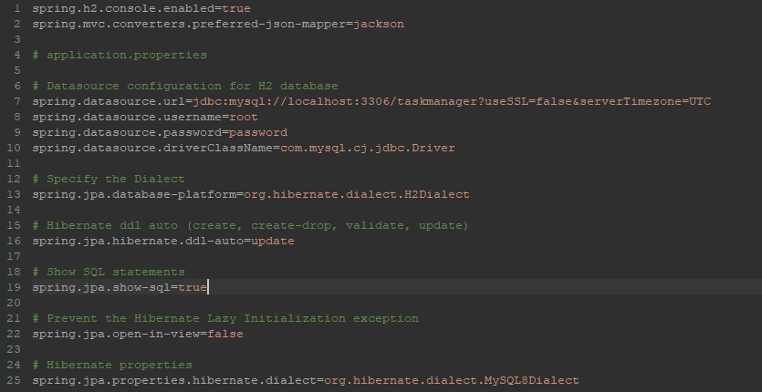
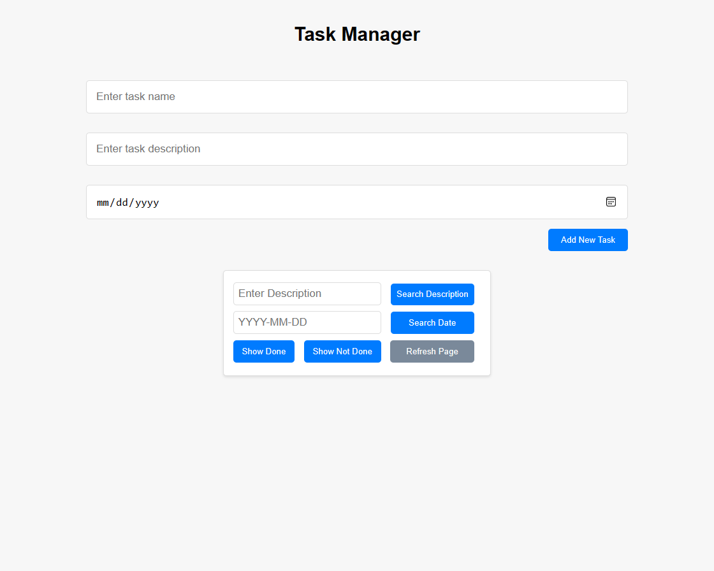
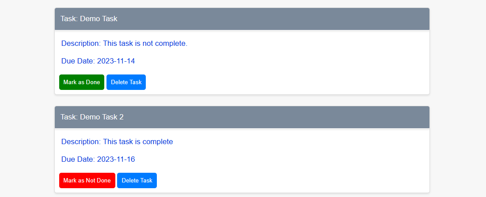

# Task Manager

This project is a practical task manager implemented with Java Spring Boot, Spring Data/JPA, and MySQL Server. 
It allows users to create tasks with descriptions and due dates, offering convenient filtering and search capabilities based on descriptions, due dates, and completion status. 
Additionally, users can delete tasks, with data persistence ensured through MySQL server storage.

A demo SQLfile is also included with this project named: TaskManagerDataBase.sql

## Table of Contents

- [Installation](#installation)
- [Usage](#usage)
- [Project Structure](#project-structure)

## Installation

This project was developed using Eclipse; however, it should be compatible with other modern IDEs as long as the necessary application dependencies and settings are configured appropriately.

Step 1: Download project from Github

- Git clone the project to a local repository.
- Import the project to your IDE of choice.
- If using eclipse, make sure that when running project you do the following:
    - Make sure to change the MySQL User Name and Password to the ones matching your local MySQL Server.
        - Find the application.properties file and make the necessary changes:
        - 
    - Find and right click on the "WebBasedTaskManager4Application.java" file and Run As > Spring Boot App.
    - All potential errors should appear on the console.
    - In your browser of choice, enter in the URL: <b>http://localhost:8080/</b>
        - To find exactly where the project is running from look for the following line in the console, the dates will be different but it should contain the proper port:
        - 2023-11-12T22:28:50.220-05:00 INFO 14140 o.s.b.w.embedded.tomcat.TomcatWebServer : Tomcat started on port(s): 8080 (http) with context path ''
    - The project should run on your chosen browser now.

## Usage

- Once the project is running on the browser it show display the following:
    - Users will be able to create tasks with descriptions and due dates.
    - Users will also be able to search for specific tasks using the filter options. The can look for tasks based on descriptions, due dates and status.
- 
- Users will be able to mark a task as Done or Not Done by clicking on the button. Users will also be able to delete the tasks at any point.
- 

## Project Structure

- The following is the base project structure. The downloaded project will contain a number of other folders and files containing dependencies and settings.

* [src](./src)
  * [main](./src/main)
    * [java](./src/main/java)
      * [com.example.demo](./src/main/java/com.example.demo)
        * [controller](./src/main/java/com.example.demo/controller)
          * [TaskController.java](./src/main/java/com.example.demo/controller/TaskController.java)
        * [model](./src/main/java/com.example.demo/model)
          * [Task.java](./src/main/java/com.example.demo/model/Task.java)
        * [repository](./src/main/java/com.example.demo/repository)
          * [TaskRepository.java](./src/main/java/com.example.demo/repository/TaskRepository.java)
        * [WebBasedTaskManager4Application.java](./src/main/java/com.example.demo/WebBasedTaskManager4Application.java)
    * [resources](./src/main/resources)
      * [templates](./src/main/resources/templates)
        * [index.html](./src/main/resources/templates/index.html)
        * [taskform.html](./src/main/resources/templates/taskform.html)
      * [static](./src/main/resources/static)
        * [css](./src/main/resources/static/css)
          * [style.css](./src/main/resources/static/css/style.css)
        * [js](./src/main/resources/static/js)
          * [script.js](./src/main/resources/static/js/script.js)
      * [application.properties](./src/main/resources/application.properties)

